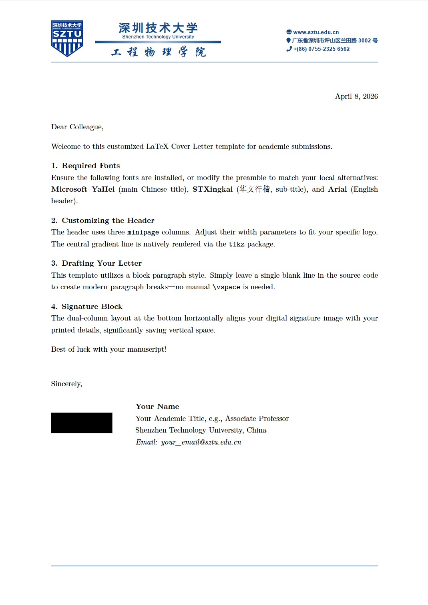

# SZTU Official Cover Letter Template 🎓

> A minimalist, highly customized LaTeX cover letter template designed for Shenzhen Technology University (SZTU) researchers and students.


This repository provides an elegant and official LaTeX letterhead template for academic manuscript submissions, official correspondence, and formal applications. 

## 🌟 Visual Preview

*(Note to author: Make sure to upload your compiled PDF screenshot to `preview/preview_full.png` so it displays here!)*

<p align="center">
  
</p>

## ✨ Key Features

- **Official Letterhead**: Accurately reproduces the SZTU branding with a vector-friendly layout and dynamic gradient split-lines.
- **Modern Typography**: Utilizes a clean block-paragraph style (`\parskip`) for excellent readability without manual spacing.
- **Space-Saving Signature Block**: Features a dual-column layout at the bottom to horizontally align your digital signature and text details, ensuring your letter fits perfectly on a single page.
- **Easy Customization**: Built with `minipage` and `fancyhdr`, making it extremely easy to tweak widths, heights, and margins.

## 📂 Repository Structure

```text
SZTU-CoverLetter-Template/
├── assets/                    # Static image resources
│   ├── SZTU.png               # Official SZTU Logo (Transparent PNG recommended)
│   └── signature.png          # Your digital signature image, not including in the template now
├── preview/                   
│   └── preview_full.jpg       # High-res screenshot for this README
├── .gitignore                 # Ignores LaTeX build files (*.log, *.aux, etc.)
├── LICENSE                    # MIT License
├── README.md                  # Project documentation
└── SZTU_CoverLetter.tex       # The main LaTeX source code
```

## 🛠️ Prerequisites
To compile this template successfully, your local environment or cloud platform must meet the following requirements:

Compiler: You MUST compile this document using XeLaTeX. (pdfLaTeX will throw errors due to advanced font packages).

System Fonts: The template calls specific system fonts to match official branding:

Microsoft YaHei (微软雅黑) - For the main Chinese title and contact info.

STXingkai (华文行楷) - For the elegant sub-title (e.g., College Name).

Arial - For English headers.

## 🚀 How to Use
Local Environment (TeX Live / MiKTeX / MacTeX)
Clone this repository:

Bash
git clone [https://github.com/YourUsername/SZTU-CoverLetter-Template.git](https://github.com/YourUsername/SZTU-CoverLetter-Template.git)
Replace assets/signature.png with your actual digital signature (transparent background recommended).

Open SZTU_CoverLetter.tex in your LaTeX editor (e.g., TeXstudio, VS Code).

Set your compiler to XeLaTeX.

Edit your personal details, recipient info, and the letter body.

Compile and generate your PDF!

Using Overleaf (Cloud)
If you prefer Overleaf, follow these steps:

Create a new blank project in Overleaf.

Upload SZTU_CoverLetter.tex, SZTU.png, and signature.png.

Crucial Step: Go to Menu (top left) -> Compiler -> Change from pdfLaTeX to XeLaTeX.

Note: Overleaf's Linux servers do not have Windows fonts pre-installed. You will need to upload msyh.ttf (YaHei) and STXINGKA.TTF to your Overleaf project and update the font definition commands in the preamble.

## 📝 License
This project is licensed under the MIT License. Feel free to fork, modify, and use it for your own academic and professional needs.